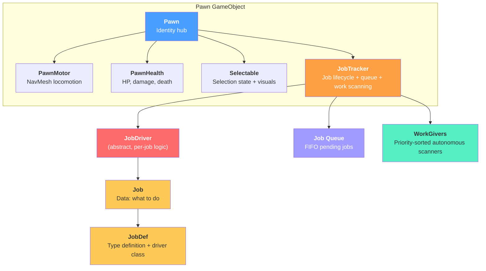
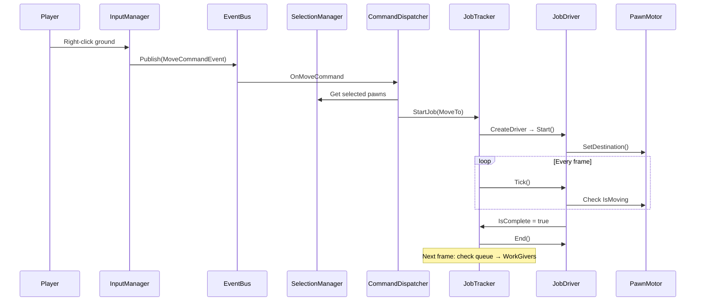
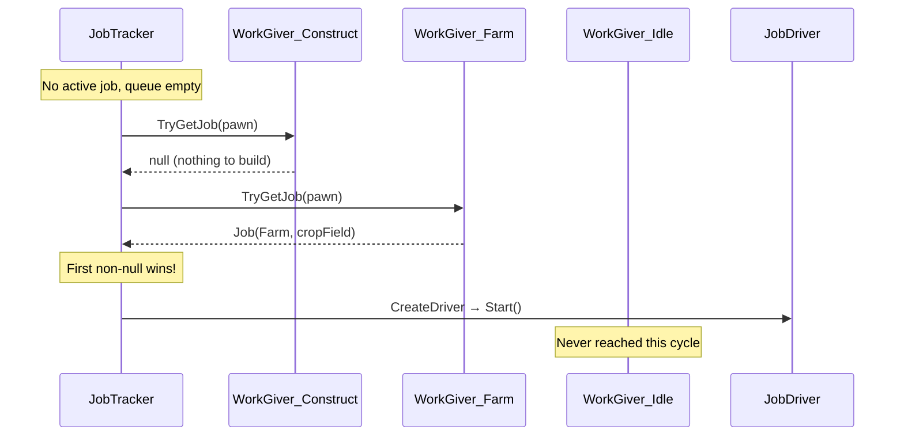
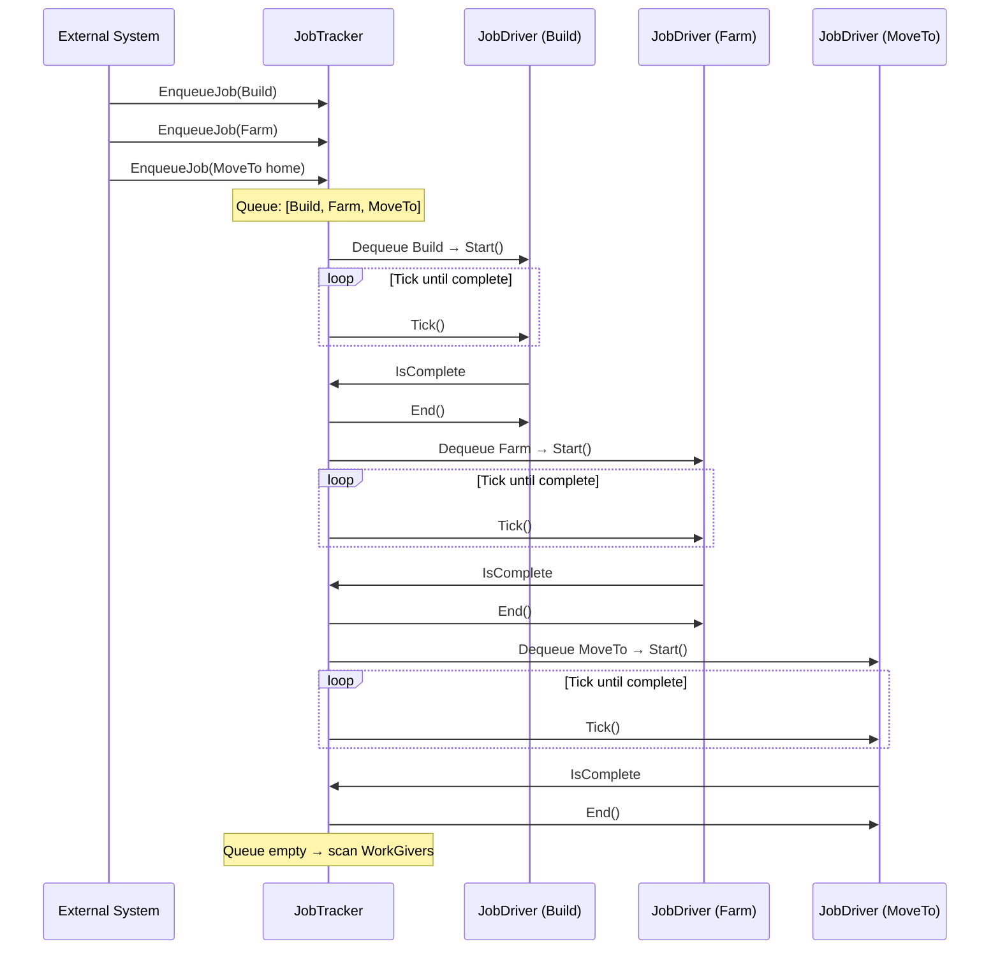
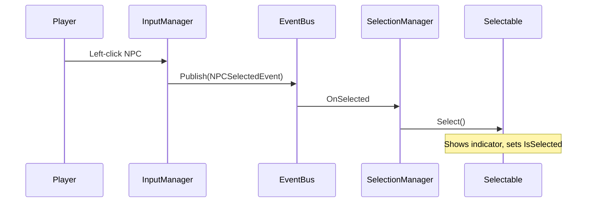

# NPC Architecture — RimWorld-Inspired Job System

## Overview

The NPC system follows a **composition-based architecture** inspired by RimWorld's Pawn system. Instead of a monolithic base class, each NPC is built from focused, single-responsibility components on a single GameObject.

**Core principle:** Data, behavior, decision-making, movement, and interaction are separate concerns — each handled by its own class.

---

## Architecture Diagram



---

## Job System — How Pawns Do Work

The job system is the heart of NPC behavior. It answers three questions:

1. **What is the pawn doing right now?** → The active Job + JobDriver.
2. **What should it do next?** → The job queue (FIFO).
3. **What should it do when it has nothing to do?** → WorkGivers (autonomous scanning).

### The Three Entry Points

Jobs enter the system through three distinct paths:

#### 1. StartJob(job) — Immediate / Player Commands

```csharp
// Player right-clicks → CommandDispatcher creates a job
pawn.Jobs.StartJob(new Job(JobDef.MoveTo, targetPosition: hitPoint));
```

- **Interrupts** any current job (calls End() on it).
- The new job starts immediately on the same frame.
- Used for: player commands, urgent interrupts, emergency responses.

#### 2. EnqueueJob(job) — Queued / Chained Work

```csharp
// Queue a sequence: move → build → return
pawn.Jobs.EnqueueJob(new Job(JobDef.MoveTo, buildSite));
pawn.Jobs.EnqueueJob(new Job(JobDef.Build, targetObject: blueprint));
pawn.Jobs.EnqueueJob(new Job(JobDef.MoveTo, homeBase));
```

- Added to the **back** of a FIFO queue.
- Processed automatically when the current job completes.
- The pawn works through the queue one job at a time: finish → dequeue next → start → repeat.
- Used for: multi-step tasks, scripted sequences, player-queued orders.

#### 3. WorkGivers — Autonomous / Self-Directed

```csharp
// Register work types the pawn can find on its own
pawn.Jobs.RegisterWorkGiver(new WorkGiver_Construct());  // priority 1
pawn.Jobs.RegisterWorkGiver(new WorkGiver_Farm());       // priority 3
pawn.Jobs.RegisterWorkGiver(new WorkGiver_Haul());       // priority 5
```

- When both the active job AND queue are empty, the pawn scans WorkGivers.
- WorkGivers are checked in **priority order** (lowest number = checked first).
- The first WorkGiver that returns a non-null Job wins — that job starts immediately.
- The scan is **throttled** (default: every 0.5s) to avoid expensive world queries every frame.
- Used for: RimWorld-style "colonists find their own work" behavior.

### Update Loop — Frame-by-Frame Decision Chain

```text
JobTracker.Update() runs every frame:
│
├─ Has active JobDriver?
│   ├─ YES → Tick() the driver
│   │         └─ IsComplete? → EndCurrentJob()
│   └─ return (don't check queue or WorkGivers this frame)
│
├─ Queue has jobs?
│   ├─ YES → Dequeue → StartJob()
│   └─ return
│
└─ Time for a work scan?
    ├─ YES → TryFindWork() via WorkGivers
    │         ├─ Found work → StartJob()
    │         └─ Nothing   → Pawn idles until next scan
    └─ NO  → Wait for scan timer
```

**Key detail:** The active job gets an `return` after its block. This means the queue and WorkGivers are only checked on frames where no job is active. A completing job triggers `EndCurrentJob()` on one frame, and the queue/WorkGiver check happens on the **next** frame. This prevents double-execution.

---

## Data Flow — Player Command



## Data Flow — Autonomous Work-Finding



## Data Flow — Job Queue Chain



## Selection Flow



---

## WorkGiver System — Deep Dive

### What Is a WorkGiver?

A WorkGiver is a scanner that answers one question: *"Is there work of type X available for this pawn?"*

Each WorkGiver:

- Represents **one category** of work (construction, farming, hauling, cleaning).
- Has a **priority** (lower number = more important, checked first).
- Has a **Label** (human-readable name for debug logs).
- Implements `TryGetJob(Pawn)` which returns a `Job` or `null`.

### How Scanning Works

1. Pawn finishes its current job and has nothing queued.
2. On the next scan cycle (throttled to every 0.5s by default), `JobTracker.TryFindWork()` runs.
3. It iterates through all registered WorkGivers **sorted by priority**.
4. The **first** WorkGiver that returns a non-null Job wins — that job is started immediately.
5. If ALL WorkGivers return null, the pawn stays idle until the next scan cycle.

### Priority Examples

| Priority     | WorkGiver                  | Description                        |
| ------------ | -------------------------- | ---------------------------------- |
| 1            | WorkGiver_EmergencyRepair  | Fix critical structural damage     |
| 2            | WorkGiver_Construct        | Build queued blueprints            |
| 3            | WorkGiver_Farm             | Tend crops that need attention     |
| 5            | WorkGiver_Haul             | Move items to stockpiles           |
| 10           | WorkGiver_Clean            | Sweep dirty areas                  |
| int.MaxValue | WorkGiver_Idle             | Fallback — always returns null     |

### Registration

WorkGivers are registered per-pawn via `JobTracker.RegisterWorkGiver()`. This means different pawns can have different capabilities:

```csharp
// A builder pawn:
pawn.Jobs.RegisterWorkGiver(new WorkGiver_Construct());
pawn.Jobs.RegisterWorkGiver(new WorkGiver_Haul());

// A farmer pawn:
pawn.Jobs.RegisterWorkGiver(new WorkGiver_Farm());
pawn.Jobs.RegisterWorkGiver(new WorkGiver_Haul());
```

The list is automatically kept sorted by priority after each registration.

### WorkGiver_Idle (Built-in)

The `WorkGiver_Idle` is automatically registered at `int.MaxValue` priority. It always returns null, ensuring the scan loop has a clean termination point. In a more advanced system, you could replace this with a wander or socialize behavior.

---

## Class Responsibilities

### NPCs/Pawn.cs

**The identity hub.** Wires all components together on Awake. Maintains a static registry of all living pawns. Handles death cleanup. Intentionally thin — it delegates everything.

- **Why it exists:** Something needs to represent "this is an NPC" and hold references to its subsystems. Without it, every system would need to `GetComponent` repeatedly.
- **One reason to change:** NPC identity data changes (e.g., adding faction, age).

### NPCs/PawnMotor.cs

**Pure locomotion.** Wraps Unity's NavMeshAgent. Validates destinations against the NavMesh. Knows nothing about jobs, selection, or game logic.

- **Why it exists:** Movement is a low-level physical concern. Other systems tell it *where* to go; it figures out *how*.
- **One reason to change:** Movement mechanics change (e.g., adding flying, swimming).

### NPCs/Modules/PawnHealth.cs

**Hit points and damage.** Tracks current/max health, applies damage, fires an `OnDeath` event. Does not decide what "dying" means — subscribers handle that.

- **Why it exists:** Health is shared across all damageable entities. Extracted so combat, environmental damage, and healing can operate independently.
- **One reason to change:** Health mechanics change (e.g., adding armor, body parts).

### NPCs/Modules/Selectable.cs

**Selection state and visuals.** Toggles a visual indicator. Maintains a static registry of all selectables. Completely decoupled from NPC logic — buildings or resources could use this too.

- **Why it exists:** Selection is a player-UI concern, not an NPC-identity concern.
- **One reason to change:** Selection visuals change (e.g., adding outline shaders).

### NPCs/Jobs/JobTracker.cs

**Job lifecycle manager + queue + autonomous work scanner.** Lives on each pawn. Manages three layers of work:

1. The **active job** (ticked every frame via its JobDriver).
2. A **FIFO queue** of pending jobs (dequeued automatically when the active job completes).
3. A **WorkGiver list** for autonomous work-finding (scanned when queue is empty).

Provides methods for immediate assignment (`StartJob`), queuing (`EnqueueJob`), clearing (`ClearQueue`, `ClearAllWork`), and WorkGiver management (`RegisterWorkGiver`, `UnregisterWorkGiver`).

- **Why it exists:** Every pawn needs exactly one place that controls "what am I doing, what's next, and how do I find work on my own?"
- **One reason to change:** Work prioritization logic becomes per-pawn (e.g., RimWorld's work tab).

### NPCs/Jobs/Job.cs

**Job data.** Pure data — what to do (JobDef), where (TargetPosition), and on what (TargetObject). Contains zero logic.

- **Why it exists:** Separates "what should happen" from "how it happens." A Job can be inspected, serialized, or logged without executing it.

### NPCs/Jobs/JobDef.cs

**Job type definition.** Links a job name to its driver class. Static instances serve as the registry of all available job types.

- **Why it exists:** This is the extension point. Adding a new behavior = creating a new JobDef + JobDriver pair. The JobTracker doesn't need to change.
- **Inspired by:** RimWorld's `JobDef` XML definitions.

### NPCs/Jobs/JobDriver.cs (abstract)

**Job execution logic.** Abstract base class. Subclasses implement Start/Tick/End to define what happens each frame during a job.

- **Why it exists:** Encapsulates the "how" of a job. Each behavior is isolated in its own class — no switch statements, no growing god-methods.

### NPCs/Jobs/Drivers/JobDriver_MoveTo.cs

**Move to a position.** Sets destination on Start, checks arrival on Tick, stops on End.

### NPCs/Jobs/Drivers/JobDriver_Interact.cs

**Move to an object, then act.** Two-phase driver (Moving → Arrived). The `OnArrived()` method is the extension point for future interaction types (gather, build, etc.).

### NPCs/Jobs/WorkGiver.cs (abstract)

**Autonomous work scanner.** Abstract base class for work-finding. Each subclass represents one category of work (construction, farming, etc.). Scanned by JobTracker in priority order when the pawn has nothing to do.

- **Why it exists:** Separates "finding work" from "doing work." Adding a new autonomous behavior means creating a new WorkGiver — no changes to JobTracker.

### NPCs/Jobs/WorkGiver_Idle.cs

**Fallback scanner.** Always returns null. Registered at lowest priority to cleanly terminate the scan loop. Can be replaced with wander/socialize behavior later.

### Core/CommandDispatcher.cs

**Bridges player input to the job system.** Listens for command events from the EventBus, creates Job instances, and assigns them to selected pawns' JobTrackers.

- **Why it exists:** SelectionManager should only track selection state. Command routing is a separate concern.
- **One reason to change:** New command types are added (e.g., GatherCommand, BuildCommand).

### Core/SelectionManager.cs

**Tracks which Selectables are selected.** Responds to selection events. Provides the selected list to other systems (like CommandDispatcher). No longer handles command dispatch.

### Core/SelectionBox.cs

**Drag-box selection UI.** Renders the selection rectangle and detects Selectables within it. Uses `Selectable.All` for detection.

### Core/InputManager.cs

**Input reader.** Reads input, publishes events. No coupling to NPC internals.

### Core/DebugManager.cs

**Togglable debug logging.** Singleton with per-category toggles exposed in the Inspector. The job system uses `DebugManager.LogJob()` for all job-related logs (assignment, queuing, completion, WorkGiver scans). Toggle via the `EnableJobSystemDebug` checkbox.

---

## Debug Logging

The job system logs through `DebugManager.LogJob()`, controlled by the `EnableJobSystemDebug` toggle in the Inspector. When enabled, you'll see:

| Log Message                                                          | When It Fires                             |
| -------------------------------------------------------------------- | ----------------------------------------- |
| `[Job] Alice started job: Build -> Blueprint`                        | A job begins (via StartJob)               |
| `[Job] Alice ended job: Build -> Blueprint`                          | A job completes or is interrupted         |
| `[Job] Alice enqueued job: Farm -> CropField (queue size: 2)`        | A job is added to the queue               |
| `[Job] Alice dequeued job: Farm -> CropField (1 remaining in queue)` | A queued job is pulled and started        |
| `[Job] Alice cleared job queue (3 jobs discarded)`                   | ClearQueue() or ClearAllWork() is called  |
| `[Job] Alice found work via Construction: Build -> Wall`             | A WorkGiver found autonomous work         |
| `[Job] Alice registered WorkGiver: Construction (priority 2)`        | A WorkGiver is registered                 |

---

## File Structure

```text
Assets/Scripts/
├── Core/
│   ├── CameraController.cs          # Camera panning and smooth movement
│   ├── CommandDispatcher.cs          # Routes player commands → Jobs
│   ├── DebugManager.cs              # Togglable debug logging (incl. [Job] channel)
│   ├── GameManager.cs               # Singleton initialization
│   ├── InputManager.cs              # Input reading → events
│   ├── SelectionBox.cs              # Drag-box selection UI
│   └── SelectionManager.cs          # Selection state tracking
├── Events/
│   ├── EventBus.cs                  # Type-safe pub/sub
│   └── GameEvents.cs                # All event struct definitions
├── NPCs/
│   ├── Pawn.cs                      # NPC identity hub
│   ├── PawnMotor.cs                 # NavMesh locomotion
│   ├── Jobs/
│   │   ├── Job.cs                   # Job data (what to do)
│   │   ├── JobDef.cs                # Job type registry
│   │   ├── JobDriver.cs             # Abstract job executor
│   │   ├── JobTracker.cs            # Per-pawn job lifecycle + queue + WorkGiver scanning
│   │   ├── WorkGiver.cs             # Abstract autonomous work scanner
│   │   ├── WorkGiver_Idle.cs        # Fallback (always returns null)
│   │   └── Drivers/
│   │       ├── JobDriver_Interact.cs  # Move to object + arrive
│   │       └── JobDriver_MoveTo.cs    # Navigate to position
│   └── Modules/
│       ├── PawnHealth.cs            # HP, damage, death events
│       └── Selectable.cs            # Selection state + visuals
└── Shared/
    └── Utilities/
        └── Strings.cs               # String constants
```

---

## How to Extend

### Adding a new autonomous behavior (e.g., Farming)

This requires three things: a JobDriver (how to do it), a JobDef (what it is), and a WorkGiver (how to find it).

**Step 1 — Create the JobDriver:**

```csharp
// Assets/Scripts/NPCs/Jobs/Drivers/JobDriver_Farm.cs
public class JobDriver_Farm : JobDriver
{
    private float farmTimer;

    public override void Start()
    {
        pawn.Motor.SetDestination(job.TargetObject.transform.position);
    }

    public override void Tick()
    {
        if (pawn.Motor.IsMoving) return;

        farmTimer += Time.deltaTime;
        if (farmTimer >= 3f)
            IsComplete = true;
    }

    public override void End()
    {
        pawn.Motor.Stop();
    }
}
```

**Step 2 — Register the JobDef:**

```csharp
// In JobDef.cs, add:
public static readonly JobDef Farm = new("Farm", typeof(JobDriver_Farm));
```

**Step 3 — Create the WorkGiver:**

```csharp
// Assets/Scripts/NPCs/Jobs/WorkGiver_Farm.cs
public class WorkGiver_Farm : WorkGiver
{
    public override int Priority => 3;
    public override string Label => "Farming";

    public override Job TryGetJob(Pawn pawn)
    {
        // Find the nearest crop that needs tending
        // Return new Job(JobDef.Farm, targetObject: crop) or null
        return null;
    }
}
```

**Step 4 — Register on pawns that should farm:**

```csharp
pawn.Jobs.RegisterWorkGiver(new WorkGiver_Farm());
```

No existing classes need modification beyond the JobDef registration.

### Queuing a multi-step task from player input

```csharp
// In CommandDispatcher, when the player shift-clicks to queue:
pawn.Jobs.EnqueueJob(new Job(JobDef.MoveTo, buildSite));
pawn.Jobs.EnqueueJob(new Job(JobDef.Build, targetObject: blueprint));
pawn.Jobs.EnqueueJob(new Job(JobDef.MoveTo, homePosition));
// Pawn will: walk → build → walk home → then scan WorkGivers
```

### Adding per-pawn work priorities (RimWorld work tab)

To let each pawn have different priority orderings:

1. Add a `Dictionary<System.Type, int>` to Pawn (maps WorkGiver type → custom priority).
2. When registering WorkGivers, check for an override before using the default priority.
3. Re-sort the WorkGiver list after applying overrides.

### Adding a new pawn module (e.g., Inventory)

1. Create `Assets/Scripts/NPCs/Modules/PawnInventory.cs` as a MonoBehaviour.
2. Add `[RequireComponent(typeof(PawnInventory))]` to `Pawn.cs`.
3. Wire it in `Pawn.Awake()`.
4. JobDrivers that need inventory access it through `pawn.Inventory`.

### Making buildings selectable

Just add a `Selectable` component to the building's GameObject. The SelectionManager and SelectionBox will automatically include it — no code changes needed.

---

## What Was Removed

| Old Class                  | Reason                                    | Replaced By                              |
| -------------------------- | ----------------------------------------- | ---------------------------------------- |
| `NPCBase`                  | God class (5+ responsibilities)           | `Pawn` + `PawnHealth` + `Selectable`     |
| `NPCMotor`                 | Renamed for consistency                   | `PawnMotor`                              |
| `NPCInteractionController` | Dead stub, never integrated               | `CommandDispatcher`                      |
| `GatherCommandEvent`       | Referenced deleted resource system        | Removed (re-add when needed)             |
| `ResourceDepletedEvent`    | Referenced deleted resource system        | Removed (re-add when needed)             |
| `ResourceDepositedEvent`   | Referenced deleted resource system        | Removed (re-add when needed)             |
