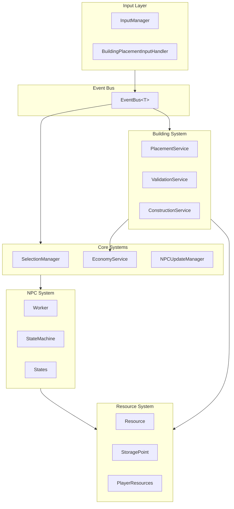

# VoxelGame Technical Documentation

Welcome to the technical documentation for the VoxelGame project. This documentation is designed to help new developers understand the codebase and safely modify it.

## Quick Start Guide

If you're new to the project, start here:

1. **[SetupGuide.md](SetupGuide.md)** - **START HERE** - Unity Editor setup instructions
2. **[FolderStructure.md](FolderStructure.md)** - **Project organization** - Where to find and add code
3. **[EventSystem.md](EventSystem.md)** - The communication backbone used by all systems
4. **[InputSystem.md](InputSystem.md)** - How player input flows into the game
5. **[NPCsAndStates.md](NPCsAndStates.md)** - Worker behavior and state machines
6. **[ResourceSystem.md](ResourceSystem.md)** - Gathering, storage, and economy
7. **[BuildingSystem.md](BuildingSystem.md)** - Placement, validation, and construction

> **First time setup?** Follow [SetupGuide.md](SetupGuide.md) to configure layers, managers, and prefabs, then review [FolderStructure.md](FolderStructure.md) to understand where code lives.

---

## System Overview



---

## Architecture Principles

### 1. Event-Driven Communication

Systems communicate via the **EventBus** using struct events:

```csharp
// Publishing
EventBus.Publish(new MoveCommandEvent { Destination = position });

// Subscribing
EventBus.Subscribe<MoveCommandEvent>(OnMoveCommand);
```

See [EventSystem.md](EventSystem.md) for details.

### 2. Service Locator Pattern

Core services are accessible via singleton instances:

```csharp
EconomyService.Instance.AddResources(playerId, type, amount);
ConstructionService.Instance.CreateBuildingSite(...);
PlacementService.Instance.StartPlacement(definition, playerId);
```

### 3. State Machine Pattern

NPCs use state machines for behavior:

```csharp
stateMachine.AddState(new GatheringState(this, stateMachine));
stateMachine.SetState<GatheringState>();
```

See [NPCsAndStates.md](NPCsAndStates.md) for details.

### 4. Data/Behavior Separation

Pure data classes are separated from MonoBehaviours:

| Data Class | MonoBehaviour |
| --- | --- |
| `BuildingSite` | `BuildingBlueprint` |
| `WorkSession` | `Resource` |
| `PlayerResources` | `EconomyService` |

---

## Key Patterns Used

| Pattern | Used For | Example |
| --- | --- | --- |
| **State Machine** | NPC behaviors | `StateMachine`, `IState` |
| **Command** | Input → action translation | `PlaceBuildingCommand` |
| **Reservation** | Preventing over-spending | `ResourceReservation` |
| **Polling** | Zero-allocation updates | `Resource.CheckWorkProgress()` |
| **Centralized Update** | Performance at scale | `NPCUpdateManager` |

---

## Common Tasks

### Adding a New Building Type

1. Create `BuildingDefinitionSO` asset
2. Create blueprint and completed prefabs
3. Add `BuildingPart` components to parts
4. Add to UI (optional)

See [BuildingSystem.md - Extending](BuildingSystem.md#extending-or-modifying-the-system)

### Adding a New NPC State

1. Create class implementing `IState`
2. Register in `InitializeStateMachine()`
3. Add `StateCategory` if needed

See [NPCsAndStates.md - Adding a New State](NPCsAndStates.md#adding-a-new-npc-state)

### Adding a New Resource Type

1. Add to `EResourceType` enum
2. Create `ResourceDefinitionSO`
3. Create resource prefab with `ResourcePiece` components
4. Configure storage points

See [ResourceSystem.md - Adding a New Resource Type](ResourceSystem.md#adding-a-new-resource-type)

### Adding a New Input Action

1. Define in Unity Input System
2. Get action reference in `InputManager`
3. Create event struct
4. Subscribe in target system

See [InputSystem.md - Adding a New Input Action](InputSystem.md#adding-a-new-input-action)

---

## Performance Considerations

### NPCs

- **Centralized update**: All NPCs updated in single `Update()` call
- **State categories**: O(1) state type queries via `StateCategory`
- **Per-worker context**: No shared static state for building

### Events

- **Zero-allocation publish**: Struct events, no boxing
- **Generic static pattern**: No dictionary lookups

### Resources

- **Polling-based work**: No callbacks or coroutines
- **Cached piece lists**: No `GetComponentsInChildren` per frame
- **Deterministic time**: `GameTick` for multiplayer-safe timing

### Building

- **Spatial hash**: O(1) distance checks for validation
- **Throttled validation**: 20 Hz validation during placement

---

## Glossary

| Term | Definition |
| --- | --- |
| **Blueprint** | In-construction building (scene object) |
| **BuildingSite** | Pure data for building under construction |
| **BuildingWorkContext** | Per-worker context for building construction (prevents multi-worker conflicts) |
| **Command** | Struct representing an action request |
| **CraftedPart** | Building part created by CraftingBench, carried and placed by workers |
| **CraftingBench** | Facility that crafts building parts from raw resources |
| **DeathDropHandler** | Component that drops NPC inventory as pickups on death |
| **EventBus** | Static event system for decoupled communication |
| **Fragment** | Carriable resource piece |
| **GameTick** | Deterministic time for multiplayer |
| **Piece** | Part of a resource that can be detached |
| **Reservation** | Pending resource transaction |
| **ResourceInventory** | Multi-type inventory storage (Dictionary-based) |
| **Session** | Tracked work progress for a worker |
| **StateCategory** | Enum for O(1) state type queries |
| **Work Session** | Struct tracking worker's progress on resource |
| **WorldResourcePickup** | Dropped resource in world that NPCs can pick up |

---

## Document Index

| Document | Description |
| --- | --- |
| [EventSystem.md](EventSystem.md) | Zero-allocation event bus pattern |
| [BuildingSystem.md](BuildingSystem.md) | Placement, validation, construction |
| [NPCsAndStates.md](NPCsAndStates.md) | State machines, worker behaviors |
| [InputSystem.md](InputSystem.md) | Input handling and commands |
| [ResourceSystem.md](ResourceSystem.md) | Gathering, storage, economy |
| [ResourceOwnership.md](ResourceOwnership.md) | Per-player resource ownership for multi-player |
| [ResourceStorageSynchronization.md](ResourceStorageSynchronization.md) | Storage and wallet synchronization model |
| [BuildingSystemRestoration.md](BuildingSystemRestoration.md) | Architecture changes and restoration notes |

---

## Code Conventions

### Naming

- **Events**: `<Noun><PastVerb>Event` (e.g., `BuildingCompletedEvent`)
- **Commands**: `<Verb><Noun>Command` (e.g., `PlaceBuildingCommand`)
- **Services**: `<Domain>Service` (e.g., `EconomyService`)
- **States**: `<Action>State` (e.g., `GatheringState`)

### Event Subscriptions

Always subscribe in `OnEnable()`, unsubscribe in `OnDisable()`:

```csharp
private void OnEnable()
{
    EventBus.Subscribe<MyEvent>(OnMyEvent);
}

private void OnDisable()
{
    EventBus.Unsubscribe<MyEvent>(OnMyEvent);
}
```

### Singleton Access

Use `Instance` property, check for null in early code:

```csharp
if (EconomyService.Instance == null)
{
    Debug.LogError("EconomyService not initialized!");
    return;
}
```

---

## Getting Help

If something isn't documented or is unclear:

1. Check the inline code comments (especially file headers)
2. Look for `DebugManager.Log*()` calls to understand flow
3. Use breakpoints in state `Enter()`/`Exit()` methods
4. Check `EventBus.GetSubscriberCount<T>()` for debugging
